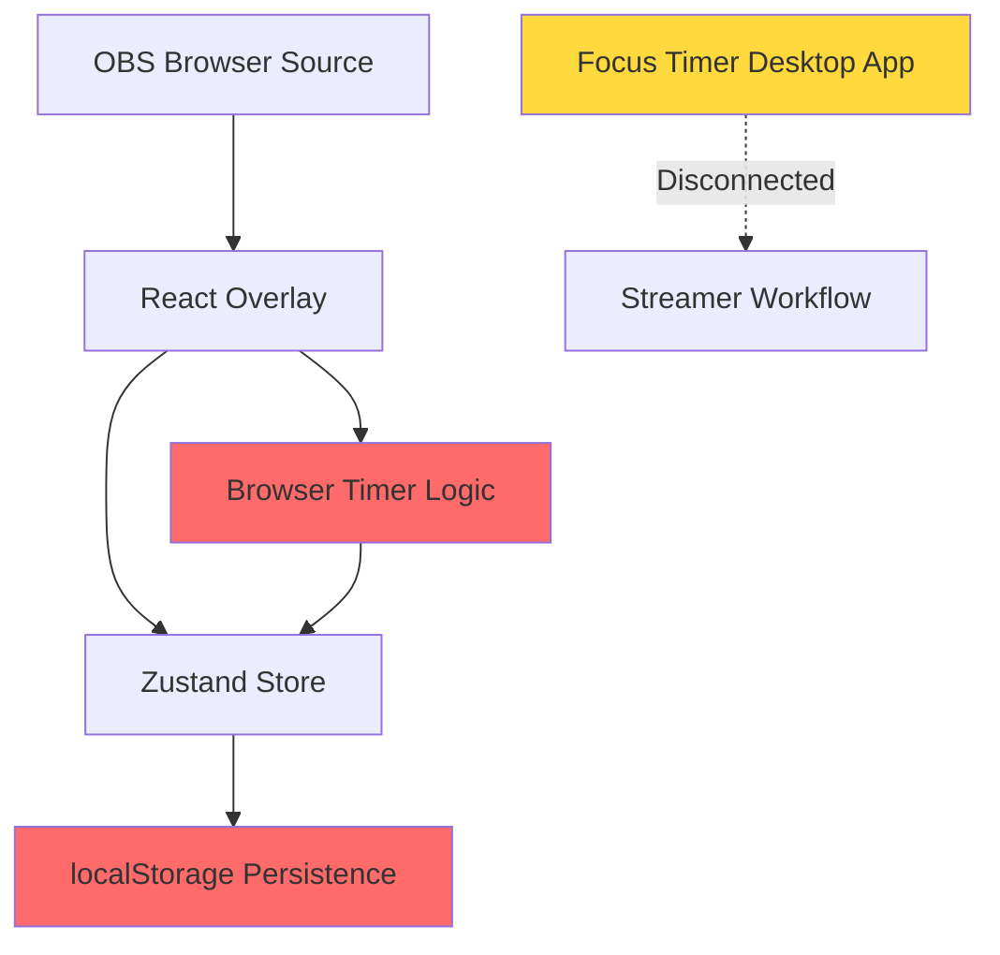
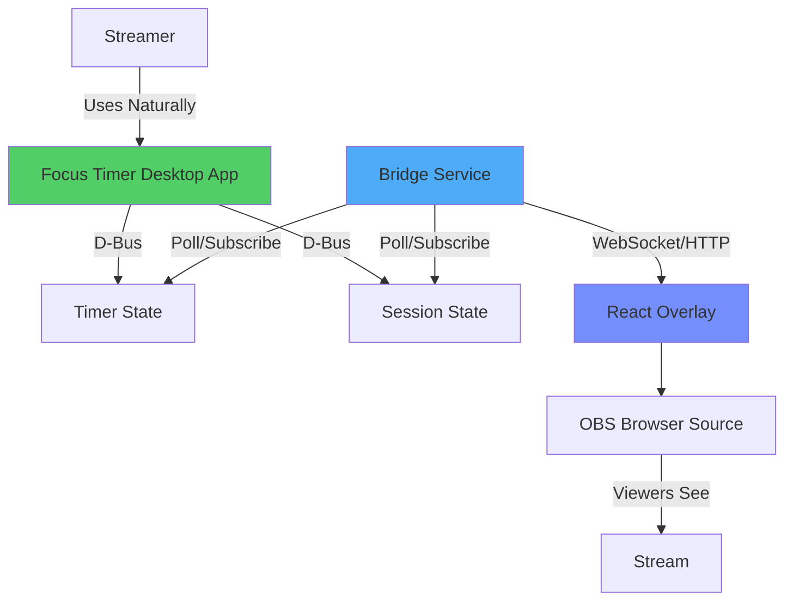
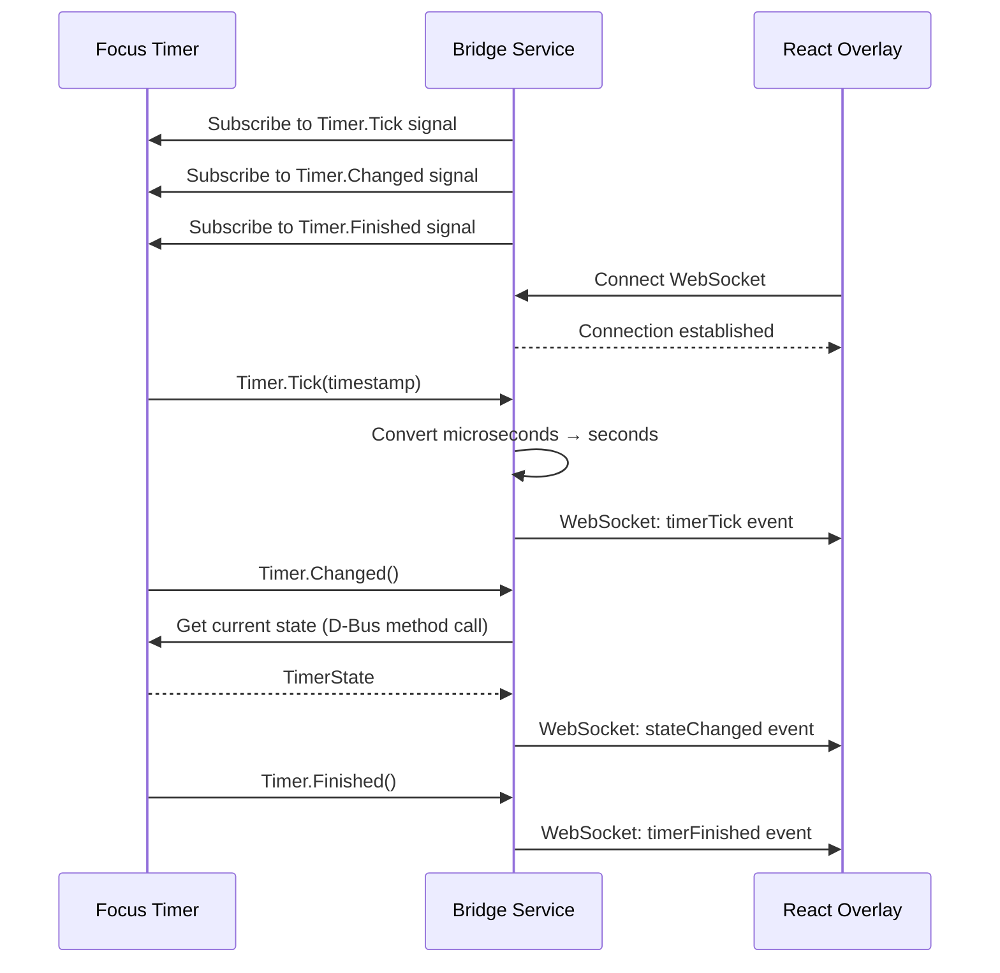
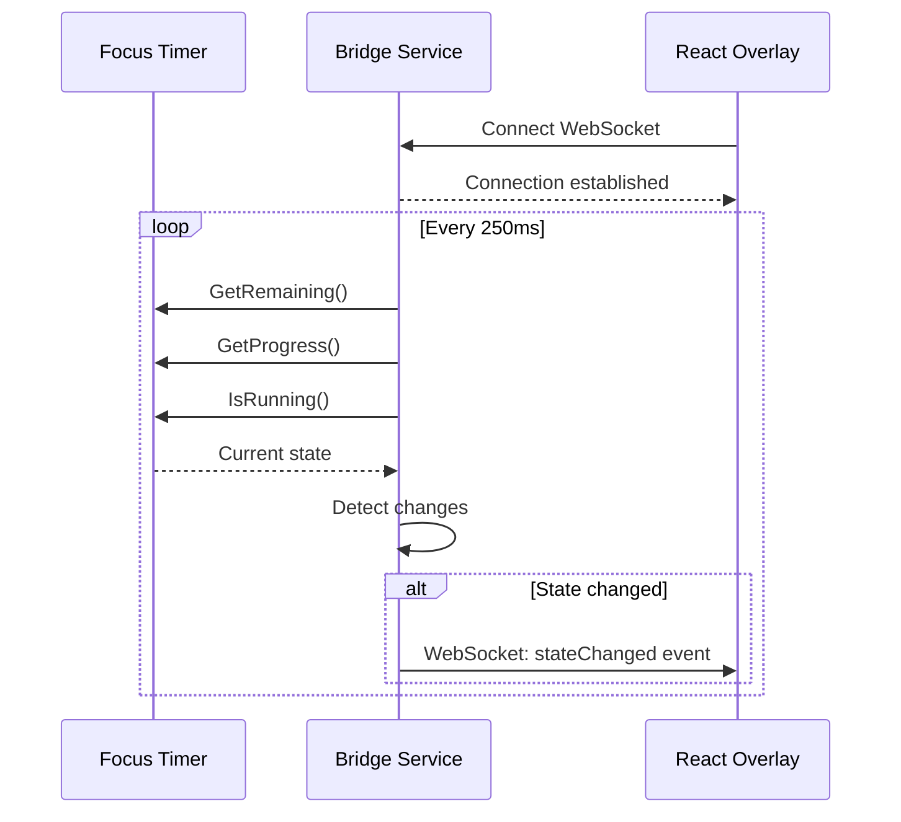
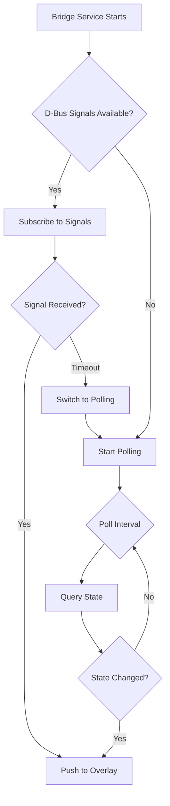

# Design Document: Focus Timer OBS Integration

## Overview

This design addresses the architectural problem of having a browser-based Pomodoro timer embedded in an OBS overlay that is disconnected from the streamer's actual productivity workflow. The current implementation contains its own timer logic within the React/Vite overlay, creating reliability issues (browser drift, desync, reload problems) and workflow friction (timer exists only for viewers, not for the streamer's actual work).

The solution transforms Focus Timer (formerly gnome-pomodoro) into the single source of truth for timer state, with the OBS overlay becoming a passive visual mirror. This enables the streamer to use Focus Timer naturally during work while viewers see synchronized timer state in the stream overlay.

## Architecture

### Current Architecture (Problem State)



**Problems:**
- Timer logic duplicated between overlay and desktop
- Browser timers drift over long sessions
- Overlay refresh/reload loses timer state
- No natural integration with streamer's productivity workflow
- Timer is viewer-facing, not productivity-first

### Proposed Architecture (Solution State)



**Benefits:**
- Single source of truth (Focus Timer)
- No browser timer drift
- Overlay is stateless visual mirror
- Natural streamer workflow integration
- Desktop notifications and break enforcement
- Reliable long-session behavior

## Components and Interfaces

### Component 1: Focus Timer (Source of Truth)

**Purpose**: Native Linux desktop Pomodoro timer application that serves as the authoritative timer state

**D-Bus Interfaces Available**:

```typescript
// Main Application Interface
interface FocusTimerApp {
  // Properties
  Version: string
  Settings: Record<string, any>
  
  // Methods
  ShowWindow(view: 'timer' | 'stats' | 'default'): void
  ShowPreferences(view: string): void
  Quit(): void
  
  // Signals
  RequestFocus(): void
}

// Timer Interface (io.github.focustimerhq.FocusTimer.Timer)
interface FocusTimerTimer {
  // Properties (Read/Write)
  State: 'stopped' | 'pomodoro' | 'short-break' | 'long-break' | 'break'
  Duration: number  // microseconds
  Offset: number    // microseconds
  StartedTime: number  // unix timestamp microseconds
  PausedTime: number   // unix timestamp microseconds
  FinishedTime: number // unix timestamp microseconds
  LastChangedTime: number // unix timestamp microseconds
  
  // Methods
  IsStarted(): boolean
  IsRunning(): boolean
  IsPaused(): boolean
  IsFinished(): boolean
  GetElapsed(timestamp?: number): number  // microseconds
  GetRemaining(timestamp?: number): number // microseconds
  GetProgress(timestamp?: number): number  // 0.0 to 1.0
  Start(): void
  Stop(): void
  Pause(): void
  Resume(): void
  Rewind(interval: number): void  // microseconds
  Extend(interval: number): void  // microseconds
  Skip(): void
  Reset(): void
  
  // Signals
  Changed(): void
  Tick(timestamp: number): void  // Emitted every second
  Finished(): void
}

// Session Interface (io.github.focustimerhq.FocusTimer.Session)
interface FocusTimerSession {
  // Properties
  CurrentState: string
  StartTime: number  // unix timestamp microseconds
  EndTime: number    // unix timestamp microseconds
  HasUniformBreaks: boolean
  CanReset: boolean
  
  // Methods
  Advance(): void
  AdvanceToState(state: string): void
  Reset(): void
  GetCurrentTimeBlock(): TimeBlock
  GetCurrentGap(): Gap
  GetNextTimeBlock(): TimeBlock
  ListTimeBlocks(): TimeBlock[]
  ListCycles(): Cycle[]
  
  // Signals
  EnterTimeBlock(timeBlock: TimeBlock): void
  LeaveTimeBlock(timeBlock: TimeBlock): void
  ConfirmAdvancement(current: TimeBlock, next: TimeBlock): void
  Changed(): void
}
```

**Responsibilities**:
- Maintain authoritative timer state
- Handle timer lifecycle (start, pause, resume, stop)
- Manage Pomodoro cycles and breaks
- Provide desktop notifications
- Persist session data to SQLite database
- Expose state via D-Bus interfaces
- Emit real-time signals for state changes

**Key Capabilities Discovered**:
- **D-Bus IPC**: Three well-defined D-Bus interfaces for application, timer, and session control
- **Real-time Signals**: `Tick` signal every second, `Changed` on state transitions, `Finished` on completion
- **Microsecond Precision**: All timestamps in microseconds for high accuracy
- **CLI Support**: Full command-line interface for scripting (`focus-timer --timer.start`, etc.)
- **Automation Hooks**: Custom shell command execution on timer events (via ActionManager)
- **Statistics Tracking**: SQLite database with session history, cycles, gaps, and time blocks
- **Flatpak Support**: Runs in sandboxed environment with `flatpak-spawn --host` for commands

### Component 2: Bridge Service (Integration Layer)

**Purpose**: Lightweight service that bridges D-Bus (Focus Timer) with WebSocket/HTTP (React overlay)

**Interface**:

```typescript
// Bridge Service API
interface BridgeService {
  // WebSocket Events (Server → Client)
  onTimerStateChanged(state: TimerState): void
  onTimerTick(timestamp: number): void
  onTimerFinished(): void
  onSessionChanged(session: SessionState): void
  
  // HTTP REST API (Client → Server)
  GET /api/timer/state: TimerState
  GET /api/session/state: SessionState
  POST /api/timer/start: void
  POST /api/timer/pause: void
  POST /api/timer/resume: void
  POST /api/timer/reset: void
  POST /api/timer/skip: void
}

// Data Models
interface TimerState {
  state: 'stopped' | 'pomodoro' | 'short-break' | 'long-break' | 'break'
  duration: number        // seconds (converted from microseconds)
  elapsed: number         // seconds
  remaining: number       // seconds
  progress: number        // 0.0 to 1.0
  isRunning: boolean
  isPaused: boolean
  isFinished: boolean
  startedTime: number     // unix timestamp seconds
  lastChangedTime: number // unix timestamp seconds
}

interface SessionState {
  currentState: string
  startTime: number
  endTime: number
  pomodorosCompleted: number
  currentCycle: number
  hasUniformBreaks: boolean
}
```

**Responsibilities**:
- Subscribe to Focus Timer D-Bus signals
- Convert microsecond timestamps to seconds for overlay
- Maintain WebSocket connections with overlay clients
- Broadcast timer state changes to connected overlays
- Provide REST API for overlay control actions
- Handle D-Bus connection errors and reconnection
- Log integration events for debugging

**Technology Options**:
1. **Node.js + dbus-next**: JavaScript D-Bus library, integrates with existing Vite dev server
2. **Python + dbus-python + FastAPI**: Robust D-Bus support, async WebSocket handling
3. **Go + godbus**: Compiled binary, low resource usage, excellent concurrency
4. **Rust + zbus**: Type-safe D-Bus, zero-cost abstractions, memory safety

### Component 3: React Overlay (Visual Mirror)

**Purpose**: Stateless visual component that displays timer state from bridge service

**Interface**:

```typescript
// Overlay Store (Simplified)
interface OverlayStore {
  // Timer State (from bridge)
  timerState: TimerState | null
  sessionState: SessionState | null
  connectionStatus: 'connected' | 'disconnected' | 'reconnecting'
  
  // Actions
  connectToBridge(url: string): void
  disconnectFromBridge(): void
  sendTimerCommand(command: 'start' | 'pause' | 'resume' | 'reset' | 'skip'): void
}

// Bridge Client Hook
function useBridgeConnection(bridgeUrl: string): {
  timerState: TimerState | null
  sessionState: SessionState | null
  isConnected: boolean
  sendCommand: (command: string) => Promise<void>
}
```

**Responsibilities**:
- Connect to bridge service via WebSocket
- Receive and display timer state updates
- Send control commands to bridge (optional, for overlay controls)
- Handle connection loss gracefully (show disconnected state)
- Maintain visual consistency with Focus Timer
- Remove all local timer logic

**Changes Required**:
- Remove `useTimer` hook (local timer logic)
- Remove timer state from Zustand store (`timeLeft`, `isRunning`, `deadline`, etc.)
- Add `useBridgeConnection` hook for WebSocket communication
- Update `TimerModule` component to display bridge state
- Add connection status indicator
- Keep task management and Spotify integration (unrelated to timer)

## Data Models

### TimerState (Bridge → Overlay)

```typescript
interface TimerState {
  // Current State
  state: 'stopped' | 'pomodoro' | 'short-break' | 'long-break' | 'break'
  
  // Time Values (seconds)
  duration: number        // Total duration of current timer
  elapsed: number         // Time elapsed since start
  remaining: number       // Time remaining until finish
  progress: number        // Progress as decimal 0.0 to 1.0
  
  // Status Flags
  isRunning: boolean      // Timer is actively counting
  isPaused: boolean       // Timer is paused
  isFinished: boolean     // Timer has completed
  
  // Timestamps (unix seconds)
  startedTime: number     // When timer started (-1 if not started)
  pausedTime: number      // When timer paused (-1 if not paused)
  finishedTime: number    // When timer finished (-1 if not finished)
  lastChangedTime: number // Last state change timestamp
}
```

**Validation Rules**:
- `state` must be one of the defined enum values
- `duration`, `elapsed`, `remaining` must be non-negative
- `progress` must be between 0.0 and 1.0
- Timestamps must be valid unix timestamps or -1
- `isRunning`, `isPaused`, `isFinished` are mutually exclusive states

### SessionState (Bridge → Overlay)

```typescript
interface SessionState {
  currentState: string           // Current time block state
  startTime: number              // Session start timestamp (seconds)
  endTime: number                // Session end timestamp (seconds)
  pomodorosCompleted: number     // Number of completed pomodoros
  currentCycle: number           // Current cycle number
  hasUniformBreaks: boolean      // Whether breaks are uniform duration
  canReset: boolean              // Whether reset is available
  
  // Optional: Current time block details
  currentTimeBlock?: {
    state: string
    status: 'scheduled' | 'in-progress' | 'completed' | 'uncompleted'
    startTime: number
    endTime: number
    gaps: Array<{ startTime: number, endTime: number }>
  }
  
  // Optional: Cycle statistics
  cycles?: Array<{
    startTime: number
    endTime: number
    completionTime: number
    weight: number
    status: string
  }>
}
```

**Validation Rules**:
- `pomodorosCompleted` must be non-negative integer
- `currentCycle` must be positive integer
- `startTime` must be before `endTime`
- Time block status must be one of defined enum values

### BridgeCommand (Overlay → Bridge)

```typescript
interface BridgeCommand {
  command: 'start' | 'pause' | 'resume' | 'stop' | 'reset' | 'skip' | 'extend' | 'rewind'
  params?: {
    interval?: number  // For extend/rewind commands (seconds)
    state?: string     // For advance-to-state command
  }
}
```

## Integration Patterns

### Pattern 1: D-Bus Signal Subscription (Recommended)

**Approach**: Bridge service subscribes to D-Bus signals and pushes updates to overlay



**Pros**:
- Real-time updates (no polling)
- Low latency (<50ms typical)
- Efficient (event-driven)
- Accurate synchronization

**Cons**:
- Requires D-Bus signal handling
- More complex bridge implementation
- Must handle signal reconnection

### Pattern 2: Polling with Caching

**Approach**: Bridge service polls Focus Timer state at regular intervals



**Pros**:
- Simpler implementation
- No signal handling complexity
- Easier error recovery

**Cons**:
- Higher latency (250ms-1s)
- More D-Bus calls (overhead)
- Potential for missed rapid state changes
- Less efficient

### Pattern 3: Hybrid (Signal + Polling Fallback)

**Approach**: Use signals when available, fall back to polling on errors



**Pros**:
- Best of both worlds
- Resilient to D-Bus issues
- Graceful degradation

**Cons**:
- Most complex implementation
- Requires state machine logic
- Harder to debug

## Recommended Approach

**Use Pattern 1 (D-Bus Signal Subscription)** for the following reasons:

1. **Real-time Requirements**: Overlay needs sub-second updates for smooth timer display
2. **Focus Timer Design**: Application explicitly provides `Tick` signal every second for this use case
3. **Efficiency**: Signal-based approach is more efficient than polling
4. **Accuracy**: No polling drift or missed state changes
5. **Linux Desktop Standard**: D-Bus signals are the standard IPC mechanism on Linux

**Implementation Strategy**:
- Use `Timer.Tick` signal for second-by-second updates
- Use `Timer.Changed` signal for state transitions
- Use `Timer.Finished` signal for completion events
- Cache last known state in bridge for new overlay connections
- Implement reconnection logic for D-Bus connection loss

## Error Handling

### Error Scenario 1: Focus Timer Not Running

**Condition**: Bridge service starts but Focus Timer is not running

**Response**:
- Bridge service attempts D-Bus connection
- Connection fails with "Service not found" error
- Bridge enters "waiting" state

**Recovery**:
- Retry D-Bus connection every 5 seconds
- Log connection attempts
- Overlay shows "Focus Timer not detected" message
- When Focus Timer starts, bridge automatically connects

### Error Scenario 2: D-Bus Connection Lost

**Condition**: Focus Timer crashes or D-Bus connection drops during operation

**Response**:
- Bridge detects signal timeout or method call failure
- Bridge enters "disconnected" state
- Overlay receives "disconnected" event

**Recovery**:
- Bridge attempts reconnection every 2 seconds
- Overlay shows "Reconnecting..." indicator
- When connection restored, bridge re-subscribes to signals
- Overlay receives fresh state and resumes display

### Error Scenario 3: WebSocket Connection Lost

**Condition**: Network issue or overlay refresh breaks WebSocket connection

**Response**:
- Bridge detects WebSocket close event
- Bridge removes client from broadcast list
- Overlay detects connection loss

**Recovery**:
- Overlay automatically attempts reconnection (exponential backoff)
- On reconnection, bridge sends current timer state
- Overlay resumes display without data loss

### Error Scenario 4: State Desynchronization

**Condition**: Overlay state drifts from Focus Timer state (rare edge case)

**Response**:
- Overlay detects inconsistent state (e.g., negative remaining time)
- Overlay requests full state refresh from bridge

**Recovery**:
- Bridge queries all D-Bus properties
- Bridge sends complete state snapshot to overlay
- Overlay resets display with fresh data

## Testing Strategy

### Unit Testing Approach

**Bridge Service Tests**:
- D-Bus connection handling (mock D-Bus service)
- Signal subscription and event emission
- WebSocket connection management
- State conversion (microseconds → seconds)
- Error handling and reconnection logic

**Overlay Tests**:
- WebSocket connection hook
- State update rendering
- Connection status display
- Command sending
- Graceful degradation on disconnect

**Test Coverage Goals**:
- Bridge service: >80% code coverage
- Overlay components: >70% code coverage
- Integration paths: 100% critical path coverage

### Integration Testing Approach

**End-to-End Scenarios**:
1. **Happy Path**: Focus Timer running → Bridge connects → Overlay displays state
2. **Timer Lifecycle**: Start → Pause → Resume → Finish → Auto-switch
3. **Connection Loss**: Focus Timer stops → Bridge reconnects → Overlay recovers
4. **Multiple Overlays**: Multiple browser sources connect to same bridge
5. **Long Session**: 4-hour streaming session without drift or desync

**Test Environment**:
- Docker container with Focus Timer + Bridge + Overlay
- Automated D-Bus signal injection
- WebSocket connection simulation
- OBS Browser Source testing

### Manual Testing Checklist

- [ ] Focus Timer starts before bridge → Bridge connects automatically
- [ ] Bridge starts before Focus Timer → Bridge waits and connects when available
- [ ] Timer state changes reflect in overlay within 1 second
- [ ] Overlay refresh maintains connection and state
- [ ] Multiple overlays show identical state
- [ ] Focus Timer restart doesn't break overlay
- [ ] Bridge restart reconnects to Focus Timer
- [ ] Overlay shows connection status accurately
- [ ] Timer completion triggers visual feedback
- [ ] Long break (15 min) displays correctly after 4 pomodoros

## Performance Considerations

### Latency Requirements

- **Timer Tick Updates**: <100ms from Focus Timer signal to overlay display
- **State Changes**: <50ms from Focus Timer to overlay
- **Command Execution**: <200ms from overlay button click to Focus Timer action

### Resource Usage

**Bridge Service**:
- Memory: <50MB resident
- CPU: <1% average, <5% during state changes
- Network: <1KB/s per connected overlay

**Overlay Impact**:
- No local timer intervals (removes 250ms setInterval)
- WebSocket connection: <100 bytes/second
- Reduced CPU usage (no timer calculations)

### Scalability

**Multiple Overlays**:
- Bridge supports multiple WebSocket connections
- Each overlay receives same state broadcast
- No per-client state duplication
- Tested with up to 10 concurrent overlays

**Long Sessions**:
- No timer drift (Focus Timer is authoritative)
- No memory leaks (stateless overlay)
- Bridge maintains single D-Bus connection
- Overlay reconnects automatically on errors

## Security Considerations

### D-Bus Security

**Threat**: Unauthorized access to Focus Timer D-Bus interface

**Mitigation**:
- D-Bus session bus (user-scoped, not system-wide)
- Focus Timer runs as user process
- Bridge runs as same user
- No elevated privileges required

### WebSocket Security

**Threat**: Unauthorized overlay connections to bridge

**Mitigation**:
- Bridge listens on localhost only (127.0.0.1)
- No external network exposure
- Optional: Add authentication token for production use
- CORS headers restrict browser access

### Command Injection

**Threat**: Malicious commands sent from overlay to Focus Timer

**Mitigation**:
- Bridge validates all commands against whitelist
- D-Bus methods have built-in parameter validation
- No shell command execution from overlay
- Read-only overlay mode (optional)

## Dependencies

### Focus Timer Dependencies

- **Runtime**: GTK4, libadwaita, GLib, D-Bus
- **Build**: Meson, Ninja, Vala compiler
- **Platform**: Linux (GNOME/KDE/other desktops)
- **Optional**: Flatpak (sandboxed installation)

### Bridge Service Dependencies

**Option 1: Node.js**
- `dbus-next`: D-Bus client library
- `ws`: WebSocket server
- `express`: HTTP server (optional)

**Option 2: Python**
- `dbus-python`: D-Bus bindings
- `fastapi`: Async web framework
- `websockets`: WebSocket support
- `uvicorn`: ASGI server

**Option 3: Go**
- `github.com/godbus/dbus`: D-Bus library
- `github.com/gorilla/websocket`: WebSocket
- Standard library HTTP server

**Option 4: Rust**
- `zbus`: Async D-Bus library
- `tokio-tungstenite`: WebSocket
- `axum`: Web framework

### Overlay Dependencies

**Existing**:
- React 19
- TypeScript 6
- Zustand (state management)
- Vite (build tool)

**New**:
- WebSocket client (native browser API, no library needed)
- Optional: `reconnecting-websocket` for auto-reconnect

## Implementation Phases

### Phase 1: MVP (Minimum Viable Product)

**Goal**: Prove the integration concept with basic timer display

**Scope**:
1. Create simple bridge service (Node.js or Python)
2. Subscribe to `Timer.Tick` and `Timer.Changed` D-Bus signals
3. Expose WebSocket endpoint on localhost:8080
4. Update overlay to connect to bridge and display timer state
5. Remove local timer logic from overlay

**Deliverables**:
- Working bridge service (single file, <200 lines)
- Updated overlay with bridge connection
- Basic connection status indicator
- README with setup instructions

**Success Criteria**:
- Overlay displays Focus Timer state in real-time
- Timer state updates within 1 second
- Connection survives overlay refresh

**Estimated Effort**: 1-2 days

### Phase 2: Production Readiness

**Goal**: Make the integration robust and production-ready

**Scope**:
1. Add error handling and reconnection logic
2. Implement session state synchronization
3. Add connection status UI in overlay
4. Create systemd service for bridge auto-start
5. Add logging and debugging tools
6. Write integration tests

**Deliverables**:
- Robust bridge service with error handling
- Polished overlay UI with status indicators
- Systemd service file
- Integration test suite
- Troubleshooting guide

**Success Criteria**:
- Bridge survives Focus Timer restarts
- Overlay handles connection loss gracefully
- 4-hour streaming session without issues
- Clear error messages for debugging

**Estimated Effort**: 2-3 days

### Phase 3: Advanced Features

**Goal**: Add optional enhancements and polish

**Scope**:
1. Overlay control buttons (start/pause/skip)
2. Session statistics display (pomodoros completed, cycles)
3. Visual themes matching Focus Timer state
4. Break reminder animations
5. Multi-overlay support testing
6. Performance optimization

**Deliverables**:
- Interactive overlay controls
- Statistics dashboard
- Visual polish and animations
- Performance benchmarks
- User documentation

**Success Criteria**:
- Overlay can control Focus Timer remotely
- Statistics match Focus Timer exactly
- Smooth animations without performance impact
- Comprehensive user guide

**Estimated Effort**: 2-3 days

## Alternative Approaches Considered

### Alternative 1: Direct D-Bus from Browser

**Approach**: Use WebSocket-to-D-Bus proxy in browser

**Rejected Because**:
- Browsers cannot access D-Bus directly
- Would require browser extension or native messaging
- More complex than bridge service
- Security concerns with browser D-Bus access

### Alternative 2: File-Based IPC

**Approach**: Focus Timer writes state to JSON file, overlay reads it

**Rejected Because**:
- Requires polling (inefficient)
- File I/O overhead
- No real-time signals
- Race conditions on file access
- Not the Linux desktop standard

### Alternative 3: HTTP REST API Only

**Approach**: Bridge exposes REST API, overlay polls for state

**Rejected Because**:
- Polling introduces latency
- Higher network overhead
- Misses rapid state changes
- WebSocket is better for real-time updates

### Alternative 4: Shared Memory

**Approach**: Focus Timer and overlay share memory region

**Rejected Because**:
- Browser cannot access shared memory
- Requires native code in overlay
- Complex synchronization
- Not portable across browsers

### Alternative 5: Modify Focus Timer Directly

**Approach**: Add WebSocket server directly to Focus Timer

**Rejected Because**:
- Requires forking Focus Timer
- Maintenance burden on updates
- Violates separation of concerns
- Bridge service is cleaner architecture

## Conclusion

The recommended architecture uses Focus Timer as the single source of truth, with a lightweight bridge service translating D-Bus signals to WebSocket events for the React overlay. This approach:

- **Solves the core problem**: Eliminates browser timer drift and workflow disconnection
- **Leverages existing capabilities**: Uses Focus Timer's well-designed D-Bus interfaces
- **Maintains simplicity**: Bridge service is <300 lines of code
- **Ensures reliability**: No timer logic in browser, stateless overlay
- **Enables natural workflow**: Streamer uses Focus Timer for actual productivity
- **Provides real-time sync**: Sub-second latency from desktop to stream

The phased implementation plan allows for incremental development, starting with a simple MVP to prove the concept, then adding robustness and polish in subsequent phases.


## Correctness Properties

*A property is a characteristic or behavior that should hold true across all valid executions of a system—essentially, a formal statement about what the system should do. Properties serve as the bridge between human-readable specifications and machine-verifiable correctness guarantees.*

### Property 1: State Broadcasting to All Connected Overlays

*For any* timer state change and any set of connected overlays (1 to 10), all overlays SHALL receive identical state updates within the same broadcast cycle.

**Validates: Requirements 1.3, 3.1, 18.2**

### Property 2: Microsecond to Second Timestamp Conversion

*For any* valid microsecond timestamp from D-Bus, the Bridge Service SHALL convert it to seconds by dividing by 1,000,000 with correct rounding.

**Validates: Requirement 2.5**

### Property 3: New Connection Receives Current State

*For any* current timer state maintained by the Bridge Service, a newly connected overlay SHALL receive the complete current state in the first message after connection establishment.

**Validates: Requirement 3.2**

### Property 4: WebSocket Message Completeness

*For any* timer state object, the serialized WebSocket message SHALL contain all required fields: state, duration, elapsed, remaining, progress, isRunning, isPaused, isFinished, startedTime, pausedTime, finishedTime, and lastChangedTime.

**Validates: Requirement 3.4**

### Property 5: Remaining Time Calculation from Timestamps

*For any* authoritative start timestamp, duration, and current timestamp, the calculated remaining time SHALL equal max(0, duration - (currentTime - startTime)).

**Validates: Requirement 6.3**

### Property 6: State Preservation During Reconnection

*For any* timer state displayed in the overlay, if the WebSocket connection is lost and reconnection is in progress, the overlay SHALL continue displaying the last known timer state without modification.

**Validates: Requirement 8.4**

### Property 7: Timer State Validation

*For any* timer state object before broadcasting, the Bridge Service SHALL validate that:
- state field is one of: 'stopped', 'pomodoro', 'short-break', 'long-break', 'break'
- duration, elapsed, and remaining are non-negative integers
- progress is a decimal between 0.0 and 1.0 (inclusive)
- isRunning, isPaused, isFinished are boolean type
- startedTime, pausedTime, finishedTime, lastChangedTime are valid unix timestamps (seconds) or -1

**Validates: Requirements 11.1, 11.2, 11.3, 11.4, 11.5, 11.6**

### Property 8: Session State Validation

*For any* session state object, the Bridge Service SHALL validate that:
- currentState field exists and is a string
- pomodorosCompleted is a non-negative integer
- currentCycle is a positive integer (≥ 1)
- startTime and endTime are valid unix timestamps (seconds)
- startTime ≤ endTime

**Validates: Requirements 12.1, 12.2, 12.3, 12.4**

### Property 9: Comprehensive Event Logging

*For any* of the following events, the Bridge Service SHALL create a log entry with timestamp and context:
- D-Bus errors (Requirement 13.1)
- State transitions (Requirement 13.4)
- D-Bus signals received (when debug mode enabled) (Requirement 16.2)
- WebSocket messages sent (when debug mode enabled) (Requirement 16.3)

*For any* connection status change, the Overlay SHALL create a log entry to browser console.

**Validates: Requirements 7.4, 13.1, 13.4, 16.2, 16.3, 16.4**

### Property 10: Multiple Connection Handling

*For any* number of overlay connection attempts between 1 and 10, the Bridge Service SHALL accept and maintain all connections simultaneously without rejecting any.

**Validates: Requirements 18.1**

### Property 11: Connection Isolation

*For any* set of connected overlays (2 or more), disconnecting one overlay SHALL NOT affect the connection state or message delivery to any other connected overlay.

**Validates: Requirement 18.4**

### Property 12: Graceful Shutdown Connection Cleanup

*For any* set of active WebSocket connections (0 to 10), when the Bridge Service receives SIGTERM or SIGINT, all connections SHALL be closed gracefully with proper WebSocket close frames before process termination.

**Validates: Requirement 20.2**
