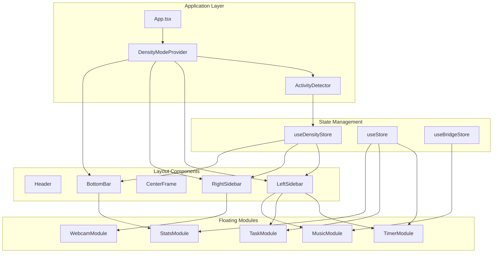
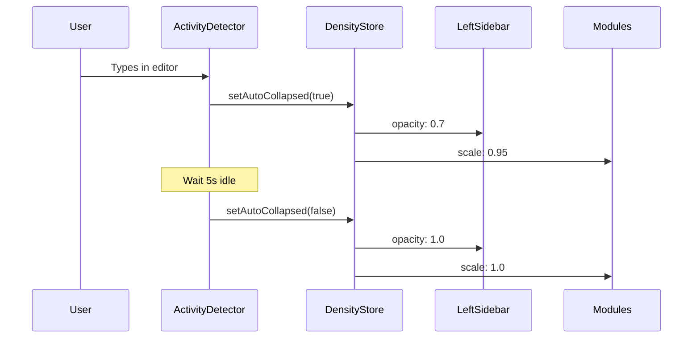

# Design Document: Overlay Spatial Optimization & Density System

**Feature:** Minimal Coding-First Stream Overlay  
**Type:** UX Redesign & Feature Enhancement  
**Status:** Draft  
**Last Updated:** 2025-01-10

---

## Overview

### Purpose

This design transforms the Stream Dashboard overlay from a "dashboard-style" interface into a **minimal ambient cinematic coding overlay** that prioritizes coding space over UI elements. The redesign addresses spatial inefficiency, visual heaviness, and lack of adaptive behavior by implementing a density mode system, floating module architecture, and intelligent auto-collapse functionality.

### Core Design Principle

**Code > Overlay. Always.**

The overlay should frame and enhance the coding experience, not compete with it. This principle drives every architectural decision in this design.

### Key Objectives

1. **Maximize Coding Space**: Increase center viewport from ~60% to ≥75% width (Stream Mode) and ≥85% (Focus Mode)
2. **Implement Density Modes**: Support three distinct overlay states (Stream/Focus/Break) with smooth transitions
3. **Create Floating Module System**: Transform boxed panels into lightweight, semi-transparent HUD elements
4. **Enable Auto-Collapse**: Detect typing activity and intelligently fade overlay during active coding
5. **Add Progressive Disclosure**: Implement collapsible left sidebar with hover-to-expand behavior
6. **Maintain 60fps Performance**: Ensure all animations use GPU-accelerated transforms

### Success Metrics

- Center viewport ≥75% width in Stream Mode (vs current ~60%)
- Center viewport ≥85% width in Focus Mode
- Bottom bar ≤60px height (vs current ~120px)
- Mode transitions complete within 500ms
- Auto-collapse triggers within 100ms of typing detection
- 60fps maintained during all animations

---

## Architecture

### System Architecture Overview



### Architectural Layers

#### 1. State Management Layer

**DensityModeStore** (`useDensityStore.ts`)
- Manages current density mode (stream/focus/break)
- Tracks auto-collapse state and opacity
- Handles sidebar expand/collapse state
- Persists user preferences to localStorage

**StreamStore** (`useStore.ts` - existing)
- Manages timer, tasks, and session data
- No changes required to existing functionality

**BridgeStore** (`useBridgeStore.ts` - existing)
- Handles WebSocket communication for Spotify
- No changes required

#### 2. Detection Layer

**ActivityDetector** (new component)
- Monitors window focus/blur events
- Tracks keyboard activity via event listeners
- Implements idle timeout logic (5s default)
- Triggers auto-collapse state changes in DensityStore

#### 3. Layout Layer

**App.tsx** (modified)
- Wraps application in DensityModeProvider
- Applies dynamic layout classes based on density mode
- Manages global keyboard shortcuts

**Layout Components** (new/modified)
- `LeftSidebar`: Collapsible sidebar with progressive disclosure
- `RightSidebar`: Compact identity module (webcam + status)
- `BottomBar`: Slim stats bar with reduced height
- `CenterFrame`: Maximized coding viewport

#### 4. Module Layer

**Floating Modules** (refactored from existing components)
- `TimerModule`: Compact timer with mode toggle
- `TaskModule`: Collapsible task list
- `MusicModule`: Spotify integration widget
- `WebcamModule`: Compact webcam frame
- `StatsModule`: Session statistics display

### Data Flow



---

## Components and Interfaces

### New Components

#### 1. DensityModeProvider

**Purpose**: Context provider for density mode state and actions

**Props**: None (wraps entire app)

**Provides**:
```typescript
interface DensityModeContext {
  mode: 'stream' | 'focus' | 'break'
  setMode: (mode: DensityMode) => void
  cycleMode: () => void
  isAutoCollapsed: boolean
  overlayOpacity: number
  sidebarExpanded: boolean
  toggleSidebar: () => void
}
```

**Implementation Notes**:
- Uses Zustand store under the hood
- Provides keyboard shortcut handlers
- Manages localStorage persistence

---

#### 2. ActivityDetector

**Purpose**: Detects user activity and triggers auto-collapse

**Props**:
```typescript
interface ActivityDetectorProps {
  enabled: boolean
  idleTimeout: number // milliseconds
  fadeOpacity: number // 0-1
}
```

**State**:
```typescript
interface ActivityState {
  isTyping: boolean
  lastActivityTime: number
  isIdle: boolean
}
```

**Event Listeners**:
- `window.addEventListener('focus')` - User returns to window
- `window.addEventListener('blur')` - User leaves window
- `window.addEventListener('keydown')` - Typing detected
- `window.addEventListener('mousemove')` - Mouse activity

**Logic**:
```typescript
// Pseudo-code
onKeyDown() {
  setIsTyping(true)
  setLastActivityTime(Date.now())
  densityStore.setAutoCollapsed(true)
}

useEffect(() => {
  const interval = setInterval(() => {
    if (Date.now() - lastActivityTime > idleTimeout) {
      setIsTyping(false)
      densityStore.setAutoCollapsed(false)
    }
  }, 250)
  return () => clearInterval(interval)
}, [lastActivityTime, idleTimeout])
```

---

#### 3. LeftSidebar

**Purpose**: Collapsible left sidebar with progressive disclosure

**Props**:
```typescript
interface LeftSidebarProps {
  mode: DensityMode
  expanded: boolean
  onToggle: () => void
}
```

**Layout by Mode**:

**Stream Mode (Default)**:
- Width: 200px
- Always visible: Timer, Current Task, Music
- Hidden by default: Full task list, Break reminder
- Expand on hover (300ms delay)

**Focus Mode**:
- Width: 120px
- Only visible: Timer (compact)
- All other widgets hidden

**Break Mode**:
- Width: 260px
- All widgets visible
- Full task list expanded
- Break reminder prominent

**Styling**:
```css
.left-sidebar {
  position: fixed;
  left: var(--safe-x);
  top: calc(60px + var(--safe-y));
  bottom: calc(60px + var(--safe-y));
  width: var(--sidebar-width);
  display: flex;
  flex-direction: column;
  gap: 12px;
  transition: width 400ms cubic-bezier(0.4, 0, 0.2, 1),
              opacity 400ms ease;
}

.left-sidebar.collapsed {
  width: 120px;
}

.left-sidebar.focus-mode {
  width: 120px;
}
```

---

#### 4. RightSidebar

**Purpose**: Compact identity module (webcam + status)

**Props**:
```typescript
interface RightSidebarProps {
  mode: DensityMode
}
```

**Layout by Mode**:

**Stream Mode**:
- Width: 180px
- Webcam (compact, 1:1 aspect ratio)
- Live status indicator
- Username display

**Focus Mode**:
- Hidden (width: 0px)

**Break Mode**:
- Width: 260px
- Webcam (larger)
- Motivation card
- Session summary

**Component Removal**:
- ❌ ChatWidget - Completely removed
- ✅ WebcamFrame - Refactored to WebcamModule
- ✅ MotivationCard - Only in Break Mode

---

#### 5. BottomBar

**Purpose**: Slim stats bar with session metrics

**Props**:
```typescript
interface BottomBarProps {
  mode: DensityMode
}
```

**Layout by Mode**:

**Stream Mode**:
- Height: 60px
- Single-row layout
- Displays: Focus time, Pomodoros, Breaks, Tasks, Daily goal ring, Streak
- Removes: Stream goal prose, Bottom ticker

**Focus Mode**:
- Height: 30px
- Minimal progress strip
- Only displays: Current session progress bar

**Break Mode**:
- Height: 80px
- Full stats with goals
- Motivation message

**Styling**:
```css
.bottom-bar {
  position: fixed;
  bottom: var(--safe-y);
  left: var(--safe-x);
  right: var(--safe-x);
  height: var(--bottom-bar-height);
  background: var(--bg-card);
  border-top: 1px solid var(--border-subtle);
  display: flex;
  align-items: center;
  gap: 16px;
  padding: 0 16px;
  transition: height 400ms cubic-bezier(0.4, 0, 0.2, 1);
}
```

---

### Refactored Components

#### TimerModule (from TimerCard)

**Changes**:
- Reduce padding by 30%
- Add floating module styling
- Support compact mode (Focus Mode)
- Maintain existing timer logic

**Compact Mode**:
- Smaller ring (100px diameter vs 150px)
- Hide mode toggle buttons
- Hide pomodoro dots
- Show only time and play/pause

---

#### TaskModule (from TaskPanel)

**Changes**:
- Support collapsed state (show only current task)
- Expand on hover with 300ms delay
- Add expand/collapse icon
- Floating module styling

**Collapsed State**:
- Height: ~80px
- Shows: Section label + first incomplete task + progress bar
- Hides: Full task list, add button

**Expanded State**:
- Height: auto (max 300px)
- Shows: Full task list with scrolling
- Shows: Add task button

---

#### MusicModule (from MusicWidget)

**Changes**:
- Reduce height
- Floating module styling
- Maintain Spotify integration

---

#### WebcamModule (from WebcamFrame)

**Changes**:
- Reduce to 1:1 aspect ratio (square)
- Smaller container (150px × 150px in Stream Mode)
- Remove excessive padding
- Floating module styling
- Add subtle pulse animation

---

#### StatsModule (from StatsBar)

**Changes**:
- Remove bottom ticker
- Remove stream goal prose
- Compact layout (single row)
- Reduce icon sizes
- Floating module styling for individual stat cards

---

### Component Hierarchy

```
App
├── DensityModeProvider
│   ├── ActivityDetector
│   ├── Header
│   ├── LeftSidebar
│   │   ├── TimerModule
│   │   ├── TaskModule (collapsible)
│   │   ├── MusicModule
│   │   └── BreakReminder (Break Mode only)
│   ├── CenterFrame
│   ├── RightSidebar
│   │   ├── WebcamModule
│   │   ├── MotivationCard (Break Mode only)
│   │   └── [ChatWidget removed]
│   └── BottomBar
│       └── StatsModule
└── KeyboardShortcutHandler
```

---

## Data Models

### DensityMode Type

```typescript
export type DensityMode = 'stream' | 'focus' | 'break'
```

### DensityModeStore Interface

```typescript
interface DensityModeStore {
  // Current state
  mode: DensityMode
  isAutoCollapsed: boolean
  overlayOpacity: number
  sidebarExpanded: boolean
  
  // Settings
  autoCollapseEnabled: boolean
  autoCollapseFadeOpacity: number // 0.5 - 0.9
  autoCollapseIdleTimeout: number // milliseconds (3000-10000)
  
  // Actions
  setMode: (mode: DensityMode) => void
  cycleMode: () => void
  setAutoCollapsed: (collapsed: boolean) => void
  toggleSidebar: () => void
  setSidebarExpanded: (expanded: boolean) => void
  
  // Settings actions
  setAutoCollapseEnabled: (enabled: boolean) => void
  setAutoCollapseFadeOpacity: (opacity: number) => void
  setAutoCollapseIdleTimeout: (timeout: number) => void
}
```

### Layout Configuration

```typescript
interface LayoutConfig {
  leftSidebarWidth: number
  rightSidebarWidth: number
  bottomBarHeight: number
  moduleGap: number
  modulePadding: number
}

const LAYOUT_CONFIGS: Record<DensityMode, LayoutConfig> = {
  stream: {
    leftSidebarWidth: 200,
    rightSidebarWidth: 180,
    bottomBarHeight: 60,
    moduleGap: 12,
    modulePadding: 16,
  },
  focus: {
    leftSidebarWidth: 120,
    rightSidebarWidth: 0,
    bottomBarHeight: 30,
    moduleGap: 8,
    modulePadding: 12,
  },
  break: {
    leftSidebarWidth: 260,
    rightSidebarWidth: 260,
    bottomBarHeight: 80,
    moduleGap: 16,
    modulePadding: 20,
  },
}
```

### Module Visibility Configuration

```typescript
interface ModuleVisibility {
  timer: boolean
  taskList: boolean
  currentTask: boolean
  music: boolean
  breakReminder: boolean
  webcam: boolean
  motivation: boolean
  stats: boolean
}

const MODULE_VISIBILITY: Record<DensityMode, ModuleVisibility> = {
  stream: {
    timer: true,
    taskList: false, // collapsed by default
    currentTask: true,
    music: true,
    breakReminder: false,
    webcam: true,
    motivation: false,
    stats: true,
  },
  focus: {
    timer: true,
    taskList: false,
    currentTask: false,
    music: false,
    breakReminder: false,
    webcam: false,
    motivation: false,
    stats: false, // only progress strip
  },
  break: {
    timer: true,
    taskList: true,
    currentTask: true,
    music: true,
    breakReminder: true,
    webcam: true,
    motivation: true,
    stats: true,
  },
}
```

---

## Error Handling

### Activity Detection Errors

**Scenario**: Event listeners fail to attach

**Handling**:
```typescript
try {
  window.addEventListener('keydown', handleKeyDown)
} catch (error) {
  console.warn('Activity detection unavailable:', error)
  // Gracefully degrade - disable auto-collapse feature
  densityStore.setAutoCollapseEnabled(false)
}
```

### LocalStorage Errors

**Scenario**: localStorage quota exceeded or unavailable

**Handling**:
```typescript
const persistMiddleware = (config) => (set, get, api) => {
  try {
    return persist(config)(set, get, api)
  } catch (error) {
    console.warn('Persistence unavailable:', error)
    // Continue without persistence
    return config(set, get, api)
  }
}
```

### Mode Transition Errors

**Scenario**: Invalid mode value from localStorage

**Handling**:
```typescript
const validateMode = (mode: unknown): DensityMode => {
  if (mode === 'stream' || mode === 'focus' || mode === 'break') {
    return mode
  }
  console.warn('Invalid density mode, defaulting to stream')
  return 'stream'
}
```

### Animation Performance Errors

**Scenario**: Low-end device struggles with animations

**Handling**:
```typescript
// Detect reduced motion preference
const prefersReducedMotion = window.matchMedia(
  '(prefers-reduced-motion: reduce)'
).matches

if (prefersReducedMotion) {
  // Disable transitions
  document.documentElement.classList.add('reduce-motion')
}
```

```css
.reduce-motion * {
  animation-duration: 0.01ms !important;
  transition-duration: 0.01ms !important;
}
```

---

## Testing Strategy

### Unit Tests

**Component Tests** (React Testing Library):
- `DensityModeProvider` - Mode switching logic
- `ActivityDetector` - Event listener attachment and idle detection
- `LeftSidebar` - Expand/collapse behavior
- `TimerModule` - Compact mode rendering
- `TaskModule` - Collapsed state display

**Store Tests** (Zustand):
- `useDensityStore` - State mutations and persistence
- Mode cycling logic
- Auto-collapse state management
- Sidebar expand/collapse state

**Hook Tests**:
- `useDensityMode` - Context consumption
- `useActivityDetection` - Idle timeout logic

### Integration Tests

**Layout Tests**:
- Verify center viewport dimensions in each mode
- Verify sidebar widths match specifications
- Verify bottom bar height changes
- Verify module visibility by mode

**Transition Tests**:
- Mode transitions complete within 500ms
- No layout thrashing during transitions
- Smooth opacity changes
- Scale transforms apply correctly

**Keyboard Shortcut Tests**:
- `Ctrl+Shift+M` cycles modes correctly
- `Ctrl+Shift+S` toggles sidebar
- `Ctrl+Shift+H` hides/shows overlay
- Shortcuts work across all modes

### Performance Tests

**Animation Performance**:
- Measure FPS during mode transitions (target: 60fps)
- Measure FPS during auto-collapse (target: 60fps)
- Verify GPU acceleration (check for `will-change` and `transform`)
- Profile with React DevTools

**Memory Tests**:
- Verify no memory leaks from event listeners
- Verify cleanup on component unmount
- Monitor memory usage over time (target: <100MB)

**CPU Tests**:
- Measure CPU usage during idle (target: <5%)
- Measure CPU usage during transitions (target: <20%)

### Visual Regression Tests

**Snapshot Tests**:
- Capture screenshots of each density mode
- Verify module positioning
- Verify floating module styling
- Verify opacity changes

### Accessibility Tests

**Keyboard Navigation**:
- All interactive elements reachable via Tab
- Focus indicators visible
- Shortcuts don't conflict with browser defaults

**Screen Reader Tests**:
- Mode changes announced
- Module visibility changes announced
- Proper ARIA labels on all controls

**Reduced Motion**:
- Verify animations disabled when `prefers-reduced-motion` is set
- Verify functionality still works without animations

### OBS Integration Tests

**Browser Source Tests**:
- Verify transparent background works
- Verify layout at 1920×1080 resolution
- Verify no performance degradation in OBS
- Verify safe area margins respected

---

## Implementation Plan

### Phase 1: Foundation (Week 1)

**Tasks**:
1. Create `useDensityStore` with Zustand
2. Implement `DensityModeProvider` context
3. Add keyboard shortcut handler
4. Update `App.tsx` to use provider
5. Add CSS custom properties for layout dimensions

**Deliverables**:
- Density mode state management working
- Keyboard shortcuts functional
- Mode switching without visual changes (foundation only)

---

### Phase 2: Layout Restructuring (Week 1-2)

**Tasks**:
1. Create `LeftSidebar` component
2. Create `RightSidebar` component
3. Create `BottomBar` component
4. Remove `ChatWidget` component
5. Update `App.tsx` layout structure
6. Implement responsive width/height changes

**Deliverables**:
- New layout structure in place
- Sidebars and bottom bar respond to mode changes
- Center viewport dimensions correct for each mode

---

### Phase 3: Floating Module System (Week 2)

**Tasks**:
1. Create floating module base styles
2. Refactor `TimerCard` → `TimerModule`
3. Refactor `TaskPanel` → `TaskModule`
4. Refactor `MusicWidget` → `MusicModule`
5. Refactor `WebcamFrame` → `WebcamModule`
6. Refactor `StatsBar` → `StatsModule`
7. Apply floating styles to all modules

**Deliverables**:
- All modules use floating style
- Semi-transparent backgrounds
- Subtle glows and shadows
- Hover effects implemented

---

### Phase 4: Progressive Disclosure (Week 2-3)

**Tasks**:
1. Implement `TaskModule` collapsed state
2. Add hover-to-expand logic
3. Add expand/collapse icon
4. Implement sidebar toggle hotkey
5. Add smooth expand/collapse animations

**Deliverables**:
- Task list collapses by default
- Expands on hover with 300ms delay
- Hotkey toggles sidebar state
- Animations smooth and performant

---

### Phase 5: Auto-Collapse (Week 3)

**Tasks**:
1. Create `ActivityDetector` component
2. Implement keyboard event listeners
3. Implement idle timeout logic
4. Connect to `useDensityStore`
5. Apply opacity and scale transforms
6. Add settings for auto-collapse configuration

**Deliverables**:
- Typing detection working
- Overlay fades to 70% opacity during typing
- Idle timeout restores opacity after 5s
- Settings allow customization

---

### Phase 6: Polish & Optimization (Week 3-4)

**Tasks**:
1. Optimize animations for 60fps
2. Add `will-change` hints
3. Implement reduced motion support
4. Add loading states
5. Add error boundaries
6. Comprehensive testing
7. Performance profiling
8. OBS integration testing

**Deliverables**:
- 60fps maintained during all transitions
- Reduced motion support
- Error handling in place
- All tests passing
- OBS compatibility verified

---

## Appendix

### CSS Custom Properties

```css
:root {
  /* Density Mode Layout */
  --sidebar-left-width: 200px;
  --sidebar-right-width: 180px;
  --bottom-bar-height: 60px;
  --module-gap: 12px;
  --module-padding: 16px;
  
  /* Floating Module Styling */
  --module-bg: rgba(20, 20, 34, 0.85);
  --module-border: rgba(255, 255, 255, 0.08);
  --module-shadow: 0 4px 20px rgba(0, 0, 0, 0.3);
  --module-glow: 0 0 20px rgba(250, 204, 21, 0.1);
  --module-radius: 16px;
  
  /* Auto-Collapse */
  --overlay-opacity: 1;
  --module-scale: 1;
  
  /* Transitions */
  --transition-mode: 400ms cubic-bezier(0.4, 0, 0.2, 1);
  --transition-collapse: 400ms ease;
  --transition-hover: 200ms ease;
}

/* Stream Mode */
[data-density-mode="stream"] {
  --sidebar-left-width: 200px;
  --sidebar-right-width: 180px;
  --bottom-bar-height: 60px;
}

/* Focus Mode */
[data-density-mode="focus"] {
  --sidebar-left-width: 120px;
  --sidebar-right-width: 0px;
  --bottom-bar-height: 30px;
}

/* Break Mode */
[data-density-mode="break"] {
  --sidebar-left-width: 260px;
  --sidebar-right-width: 260px;
  --bottom-bar-height: 80px;
}

/* Auto-Collapsed State */
[data-auto-collapsed="true"] {
  --overlay-opacity: 0.7;
  --module-scale: 0.95;
}
```

### Floating Module Base Class

```css
.floating-module {
  background: var(--module-bg);
  border: 1px solid var(--module-border);
  border-radius: var(--module-radius);
  padding: var(--module-padding);
  box-shadow: var(--module-shadow);
  backdrop-filter: blur(12px);
  position: relative;
  transition: all var(--transition-hover);
  opacity: var(--overlay-opacity);
  transform: scale(var(--module-scale));
  will-change: transform, opacity;
}

.floating-module::before {
  content: '';
  position: absolute;
  inset: -1px;
  border-radius: var(--module-radius);
  padding: 1px;
  background: linear-gradient(
    135deg,
    rgba(250, 204, 21, 0.2),
    transparent 50%,
    rgba(167, 139, 250, 0.1)
  );
  -webkit-mask: linear-gradient(#fff 0 0) content-box, 
                linear-gradient(#fff 0 0);
  -webkit-mask-composite: xor;
  mask-composite: exclude;
  opacity: 0;
  transition: opacity var(--transition-hover);
  pointer-events: none;
}

.floating-module:hover {
  transform: translateY(-2px) scale(var(--module-scale));
  box-shadow: var(--module-shadow), var(--module-glow);
}

.floating-module:hover::before {
  opacity: 1;
}
```

### Animation Performance Checklist

✅ **Use GPU-Accelerated Properties Only**:
- `transform` (translate, scale, rotate)
- `opacity`
- ❌ Avoid: `width`, `height`, `top`, `left`, `margin`, `padding`

✅ **Add `will-change` Hints**:
```css
.animating-element {
  will-change: transform, opacity;
}
```

✅ **Use `transform: translateZ(0)` for Layer Promotion**:
```css
.floating-module {
  transform: translateZ(0);
}
```

✅ **Batch Layout Changes**:
```typescript
// Bad: Multiple layout reads/writes
element.style.width = '200px'
const height = element.offsetHeight
element.style.height = '300px'

// Good: Batch reads, then batch writes
const height = element.offsetHeight
requestAnimationFrame(() => {
  element.style.width = '200px'
  element.style.height = '300px'
})
```

✅ **Use `requestAnimationFrame` for Smooth Updates**:
```typescript
const animate = () => {
  // Update state
  requestAnimationFrame(animate)
}
requestAnimationFrame(animate)
```

✅ **Debounce Expensive Operations**:
```typescript
const debouncedResize = debounce(() => {
  // Handle resize
}, 150)

window.addEventListener('resize', debouncedResize)
```

---

## References

### Design Inspiration

- **Valorant HUD**: Minimal, floating elements with subtle glows
- **Apex Legends HUD**: Clean information hierarchy, ambient transparency
- **VS Code**: Progressive disclosure, collapsible panels
- **Figma**: Floating toolbars, context-aware UI

### Technical References

- [CSS Triggers](https://csstriggers.com/) - GPU-accelerated properties
- [Web Animations API](https://developer.mozilla.org/en-US/docs/Web/API/Web_Animations_API)
- [Zustand Documentation](https://docs.pmnd.rs/zustand/getting-started/introduction)
- [React Performance Optimization](https://react.dev/learn/render-and-commit)

### Accessibility References

- [WCAG 2.1 Guidelines](https://www.w3.org/WAI/WCAG21/quickref/)
- [Reduced Motion](https://developer.mozilla.org/en-US/docs/Web/CSS/@media/prefers-reduced-motion)
- [Keyboard Navigation](https://www.w3.org/WAI/WCAG21/Understanding/keyboard.html)

---

**Document Status:** Complete  
**Next Step:** Task Breakdown & Implementation
